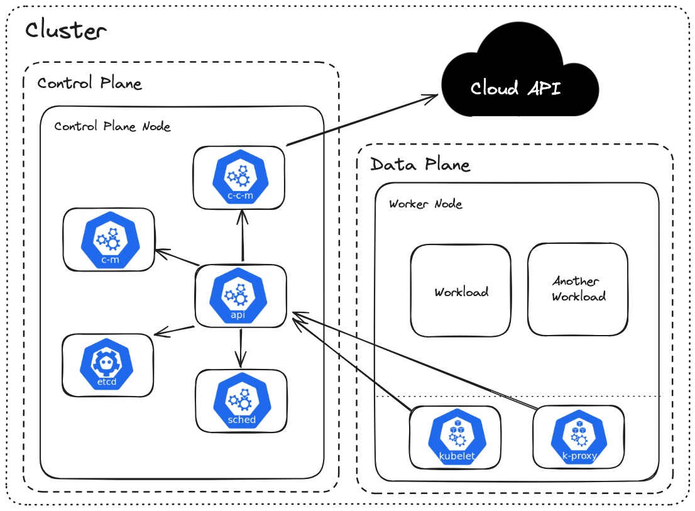
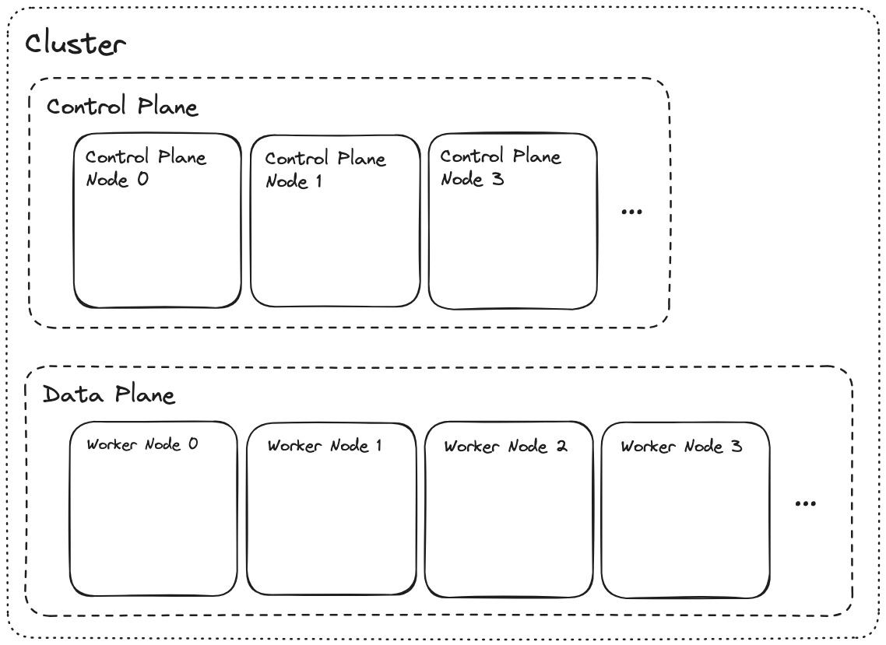

# Kubernetes YT Course

## Useful Links

- [Course YouTube Video](https://youtube.com/watch?v=2T86xAtR6Fo)
- [Course Notes](https://courses.devopsdirective.com/kubernetes-beginner-to-pro/lessons/00-introduction/01-main)
- [Course GitHub Repository](https://github.com/sidpalas/devops-directive-kubernetes-course)

## Tools & Platforms

- **DevBox**: Beginner-friendly Nix environment manager
- **KinD**: Run local Kubernetes clusters using Docker containers (Kubernetes IN Docker)
- **GKE**: Google Kubernetes Engine

## Diagrams




---

## Mise

If you prefer using **Mise** instead of Devbox:

1. **Trust and install the tools**:

   ```bash
   mise trust
   ```

   ```bash
   mise install
   ```

2. **Initialize project-specific binaries** (like `cloud-provider-kind`):

   ```bash
   mise run bootstrap
   ```

3. **Space-Saving Cleanup**:
   To delete the installed tools from disk while leaving the repository and `mise.toml` intact for future reference:

   ```bash
   mv mise.toml mise.toml.bak && mise prune && mv mise.toml.bak mise.toml
   ```
